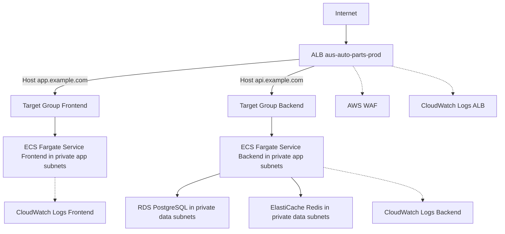

# Cloud Infrastructure Plan

This plan defines a minimal, secure, production-ready architecture for exposing:

- Public web app at https://app.example.com
- Public/partner API at https://api.example.com

using the existing Dockerized frontend and backend without code changes.

Primary provider: AWS.

The design focuses on:

- Simple, directly implementable architecture compatible with current Docker images.
- Clear mapping from containers in [`docker-compose.prod.yml`](docker-compose.prod.yml:1) to AWS services.
- Strong security defaults and straightforward growth path.

---

## 1. Core Components

### 1.1 Compute

Chosen: AWS ECS Fargate (serverless containers)

Rationale:

- Natively runs Docker images with no cluster management.
- Integrates cleanly with Application Load Balancer, IAM, CloudWatch, Secrets Manager, and VPC networking.
- Scales easily from "starter" to "growth" with minimal redesign.
- Aligns well with separate frontend and backend services.

Services:

1. Frontend Service (ECS Fargate)
   - Task Definition:
     - Uses the built frontend image built from [`frontend/Dockerfile`](frontend/Dockerfile:1).
     - Container:
       - Image: ECR repo `aus-auto-parts-frontend`.
       - Port: 80 (Nginx in the image).
     - Environment:
       - Built with `VITE_API_URL` pointing at the API URL for the given environment, e.g.:
         - Prod: `https://api.example.com/api/v1`
         - Staging: `https://api.staging.example.com/api/v1`
       - No DB/Redis access needed.
     - Networking:
       - Runs in private subnets.
       - Fronted by an ALB listener for HTTPS (app.example.com).
   - ECS Service:
     - Fargate launch type.
     - Min 1–2 tasks (per env) with auto-scaling based on CPU/Memory/RequestCount.

2. Backend Service (ECS Fargate)
   - Task Definition:
     - Uses backend image from [`backend/Dockerfile`](backend/Dockerfile:1).
     - Container:
       - Image: ECR repo `aus-auto-parts-backend`.
       - Port: 3000 (as per Dockerfile EXPOSE).
     - Environment (injected via SSM/Secrets Manager, not baked in):
       - `NODE_ENV=production`
       - `PORT=3000`
       - `DATABASE_URL` pointing to RDS endpoint.
       - `REDIS_HOST`, `REDIS_PORT`, `REDIS_PASSWORD` (if Redis auth enabled).
       - Any JWT/crypto/payment secrets as secure parameters/secrets.
   - Networking:
     - Runs in private subnets.
     - Only accessible via:
       - Internal ALB target group (from the public ALB for `api.example.com`).
       - Internal VPC endpoints where applicable.
   - ECS Service:
     - Fargate launch type.
     - Min 1–2 tasks.
     - Auto-scaling based on CPU/Memory and ALB target metrics.

No code changes required: the containers already respect env vars (`PORT`, `DATABASE_URL`, `VITE_API_URL`, etc.).

---

### 1.2 Database

Chosen: Amazon RDS for PostgreSQL

- One RDS PostgreSQL instance/cluster per environment (dev/staging/prod) or an isolated dev schema where practical.
- Placed in private subnets (no public IP).
- Security Group:
  - Inbound: allow TCP 5432 only from:
    - Backend ECS tasks security group (per environment).
  - Outbound: default VPC egress as needed.
- Storage:
  - Starter: Single-AZ, gp3 storage, automated backups enabled.
  - Growth: Multi-AZ, provisioned IOPS, performance insights enabled.

Connection:

- Backend `DATABASE_URL` uses RDS endpoint, injected securely via SSM/Secrets Manager into ECS task definitions.
- No direct public internet access.

---

### 1.3 Cache

Chosen: Amazon ElastiCache for Redis (recommended)

- One Redis replication group or cluster per environment (or at least distinct logical clusters).
- Deployed into private subnets.
- Security Group:
  - Inbound: allow only from Backend ECS tasks SG on Redis port (default 6379).
- Use for:
  - Caching, sessions, rate limiting, etc., as used by the existing backend configuration.

Alternative (only if cost-sensitive and non-critical):

- Starter tier may use:
  - Redis on a small EC2 instance in a private subnet with:
    - SG restricted to Backend ECS tasks only.
    - Managed via SSM for access, no public IP.
  - Clear migration path: same env vars, swap host to ElastiCache endpoint later.

---

### 1.4 Storage for Assets and Logs

1. Static Assets:
   - Option A (simple): Frontend stays fully containerized and served by Nginx behind ALB. No extra asset storage required.
   - Option B (optimize later): Build artifacts uploaded to S3, served via CloudFront; ECS only for API. Not required initially, but supported by this architecture.

2. Logs:
   - ECS Task logs:
     - Ship container stdout/stderr to CloudWatch Logs.
     - Separate log groups: `/aus-auto-parts/{env}/backend`, `/aus-auto-parts/{env}/frontend`.
   - ALB access logs:
     - Enabled to S3 bucket `aus-auto-parts-alb-logs-{account}-{region}` with restricted access.
   - RDS logs:
     - Enabled and viewable via CloudWatch where supported.

---

## 2. Networking Design

### 2.1 VPC and Subnets

Per environment (or shared with strict separation):

- One VPC per environment is preferred for clarity and isolation:
  - e.g. `aus-auto-parts-dev-vpc`, `aus-auto-parts-staging-vpc`, `aus-auto-parts-prod-vpc`.

Inside each VPC:

- Public Subnets (at least 2 AZs):
  - For:
    - Internet-facing ALB.
    - NAT gateways (per AZ) where budget allows.
- Private Application Subnets (at least 2 AZs):
  - For:
    - ECS Fargate tasks (frontend and backend).
- Private Data Subnets (at least 2 AZs):
  - For:
    - RDS PostgreSQL.
    - ElastiCache Redis.

Routing:

- Public subnets:
  - Route 0.0.0.0/0 to Internet Gateway.
- Private app subnets:
  - Route 0.0.0.0/0 via NAT Gateway (for ECS tasks to pull images, reach AWS APIs).
- Private data subnets:
  - No direct internet route.
  - Access only via VPC internal traffic.

### 2.2 Security Groups

Key SGs (per environment):

1. ALB SG:
   - Inbound:
     - 443 from 0.0.0.0/0 (and optionally specific CIDRs for admin endpoints later).
   - Outbound:
     - To ECS frontend TG on port 80.
     - To ECS backend TG on port 3000 (for `api.example.com`) if using same ALB.

2. Frontend ECS SG:
   - Inbound:
     - From ALB SG on port 80.
   - Outbound:
     - To backend API via ALB or directly if needed.
     - To NAT for outbound internet (CDN, APIs if used by server side).
   - No inbound from public internet.

3. Backend ECS SG:
   - Inbound:
     - From ALB SG on port 3000 (for public/partner `api.example.com`).
     - Optionally from Frontend ECS SG if you route internal-only traffic directly.
   - Outbound:
     - To RDS SG on 5432.
     - To Redis SG on 6379.
     - To NAT for external APIs (e.g. payment gateways).
   - No inbound from public IP ranges.

4. RDS SG:
   - Inbound:
     - From Backend ECS SG on 5432 only.
   - No public ingress.

5. Redis SG:
   - Inbound:
     - From Backend ECS SG on 6379 only.
   - No public ingress.

This ensures PostgreSQL and Redis remain private.

---

## 3. Ingress, Domain, and SSL

### 3.1 Application Load Balancer

One ALB per environment (or shared for non-prod if desired) with separate listeners and target groups.

For prod:

- ALB:
  - Internet-facing.
  - In public subnets.
  - SG as defined above.

Listeners and rules:

1. HTTPS :443 listener:
   - Default TLS certificate(s) issued via AWS Certificate Manager (ACM).
   - Host-based routing:

   - Rule 1: `Host: app.example.com`
     - Forward to Target Group: `tg-frontend-prod` (ECS frontend service on port 80).
   - Rule 2: `Host: api.example.com`
     - Forward to Target Group: `tg-backend-prod` (ECS backend service on port 3000).

2. HTTP :80 listener:
   - Redirect all HTTP to HTTPS (301 redirect).

Health checks:

- Frontend:
  - Path: `/` or `/health` if/when provided by Nginx.
- Backend:
  - Path: `/api/v1/health` (aligned with [`backend/Dockerfile`](backend/Dockerfile:51)'s healthcheck comment).

### 3.2 DNS (Route 53)

- Hosted Zone: `example.com` in Route 53 (or integrated with existing registrar via NS records).
- Records:
  - `app.example.com`:
    - Type: A / AAAA Alias to the ALB.
  - `api.example.com`:
    - Type: A / AAAA Alias to the ALB.

### 3.3 SSL/TLS Certificates

- Use AWS Certificate Manager (ACM) in same region as ALB.
- Request:
  - `app.example.com`
  - `api.example.com`
  - Optionally `*.example.com` for flexibility.
- Validation: DNS validation via Route 53.
- Attach ACM certificate to ALB HTTPS listener.

---

## 4. Environment and Configuration Management

Goals:

- No secrets in images or repo.
- Clear, environment-specific configuration for URLs and data stores.

### 4.1 Secrets and Parameters

Use a combination of:

- AWS Systems Manager Parameter Store (for non-sensitive configuration).
- AWS Secrets Manager (for sensitive secrets), or SSM SecureString for cost-optimized setups.

Examples per environment:

- SSM / Parameter Store:
  - `/aus-auto-parts/{env}/api/BASE_URL`
  - `/aus-auto-parts/{env}/frontend/APP_URL`
  - `/aus-auto-parts/{env}/backend/LOG_LEVEL`
- Secrets Manager:
  - `/aus-auto-parts/{env}/db/credentials`
  - `/aus-auto-parts/{env}/redis/credentials` (if applicable)
  - `/aus-auto-parts/{env}/auth/jwt_secret`
  - `/aus-auto-parts/{env}/payment/provider_api_key`

ECS Task Definitions:

- Configure task definition to:
  - Pull env vars from SSM/Secrets Manager.
  - Map keys to container environment variables expected by the existing app.

### 4.2 Key Application Variables

1. `VITE_API_URL`
   - Used at build time for the frontend.
   - For each environment, the build pipeline sets:
     - Dev: `https://api.dev.example.com/api/v1`
     - Staging: `https://api.staging.example.com/api/v1`
     - Prod: `https://api.example.com/api/v1`

2. `DATABASE_URL`
   - Format: standard Postgres URL with RDS endpoint.
   - For each environment:
     - Value pulled from Secrets Manager and injected into backend ECS tasks.

3. `REDIS_*`
   - `REDIS_HOST`: ElastiCache primary endpoint.
   - `REDIS_PORT`: usually 6379.
   - `REDIS_PASSWORD`: if Redis AUTH is enabled.
   - Managed via Secrets Manager, injected into backend ECS.

Other env vars used by backend or frontend should follow the same pattern: defined centrally per env in SSM/Secrets Manager and referenced from ECS task definitions.

---

## 5. Deployment Environments

Minimal but clear model:

### 5.1 Dev

Options:

- Option A (recommended for team scale): Dedicated `dev` AWS environment.
  - VPC: `aus-auto-parts-dev-vpc`
  - Cheaper RDS instance, small ElastiCache or single small Redis instance.
  - ECS services:
    - `app.dev.example.com`
    - `api.dev.example.com`
- Option B: For solo developer / small team, rely on local Docker for dev and use shared `staging` as first cloud env.

### 5.2 Staging

- Mirrors production topology on smaller scale:
  - VPC: `aus-auto-parts-staging-vpc`
  - ALB:
    - `app.staging.example.com`
    - `api.staging.example.com`
  - ECS services, RDS, Redis all isolated from prod.

### 5.3 Production

- Dedicated `prod` AWS account or at least a fully isolated VPC:
  - `aus-auto-parts-prod-vpc`
  - Separate ALB, ECS clusters/services, RDS, Redis.
  - Tighter security controls and monitoring.

Environment separation patterns:

- Strongly recommended: separate AWS accounts for dev, staging, and prod with AWS Organizations; identical architecture per account.
- If single account:
  - Use separate VPCs, prefixed resource names, and IAM boundaries.

---

## 6. Security Model

### 6.1 Principle of Least Privilege

- IAM:
  - ECS Task Roles:
    - Backend task role:
      - Permissions to read only the specific SSM parameters and secrets it needs.
      - No wildcard `*` on resources.
    - Frontend task role:
      - Typically minimal: read logging and telemetry endpoints only if needed.
  - CI/CD roles:
    - Separate roles for deploying ECS services, updating task definitions, and managing infrastructure.
- Do not use root keys. Enforce MFA and strong IAM hygiene.

### 6.2 Network Security

- No public IPs on ECS tasks, RDS, or Redis.
- Only ALB is internet-facing.
- Security groups restrict traffic:
  - ALB → ECS only on required ports.
  - ECS → RDS/Redis only on required ports.
- Use AWS PrivateLink or VPC endpoints for AWS APIs where appropriate.

### 6.3 Data Protection

- Encryption at rest:
  - RDS PostgreSQL: KMS-managed encryption enabled.
  - ElastiCache: in-transit and at-rest encryption enabled (for growth/prod).
  - S3 buckets (logs, assets): KMS or SSE-S3.
- Encryption in transit:
  - TLS for all external traffic via ALB.
  - Backend can support HTTPS for external dependencies; internal traffic secured by VPC isolation and SGs (optionally use mTLS for stricter setups).

### 6.4 Logging, Monitoring, WAF/DoS

- Logging:
  - ECS logs → CloudWatch Logs.
  - ALB access logs → S3.
  - RDS performance/slow query logs enabled for prod/staging.

- Monitoring:
  - CloudWatch metrics and alarms on:
    - ALB 5xx/4xx rates.
    - ECS task CPU/memory.
    - RDS CPU, connections, free storage.
    - ElastiCache CPU/memory/evictions.
  - Optional: integrate with AWS X-Ray or third-party APM later.

- WAF and DoS:
  - Attach AWS WAF to ALB in prod:
    - Use AWS Managed Rules sets for common threats.
    - Add rules for basic rate limiting on `/api`.
  - AWS Shield Standard: enabled by default for ALB for infra-level DDoS protection.

---

## 7. Cost Tiers

High-level, realistic tiers.

### 7.1 Starter Tier

Goals: Low cost, production-capable for low traffic.

- Compute:
  - ECS Fargate:
    - Frontend: 1 task (0.25 vCPU, 512 MB).
    - Backend: 1 task (0.5 vCPU, 1–2 GB).
- DB:
  - RDS PostgreSQL:
    - Single-AZ, small instance (e.g. db.t4g.micro or db.t3.micro/gp3).
- Cache:
  - Option A: Small ElastiCache node (e.g. cache.t4g.micro) if needed.
  - Option B: Private EC2-based Redis for cost saving (with caution).
- Networking:
  - 1 NAT Gateway per environment (or shared strategy; can be a noticeable cost).
- Security/Monitoring:
  - CloudWatch logs and basic alarms.
  - WAF optional; can be added for prod when API exposure grows.

This tier still enforces:
- No public DB/Redis.
- HTTPS via ALB + ACM.
- IAM least privilege.

### 7.2 Growth Tier

Goals: Handle higher traffic, stronger resilience, and compliance.

- Compute:
  - ECS Fargate:
    - 2+ tasks per service across 2+ AZs.
    - Auto-scaling based on target utilization and request rates.
- DB:
  - RDS PostgreSQL:
    - Multi-AZ deployment.
    - Larger instance (db.t4g.medium / db.m6g.large or similar).
    - Automated backups and read replicas if needed.
- Cache:
  - ElastiCache Redis:
    - Multi-AZ with automatic failover.
    - Proper parameter group tuning.
- Networking:
  - Multiple NAT Gateways (per AZ).
  - VPC endpoints for SSM, ECR, etc. to reduce NAT usage.
- Security:
  - AWS WAF on ALB with custom and managed rule sets.
  - Centralized logging, potentially aggregated to security account.
  - Additional IAM guardrails, SCPs, separate accounts for environments.
- Observability:
  - Detailed dashboards, anomaly detection, request tracing, and alerting.

---

## 8. Architecture Diagram (Conceptual)

Mermaid-style overview for production (simplified):

---

## 9. Direct Compatibility with Existing Docker Setup

This architecture is directly runnable with the current images:

- Frontend:
  - Uses [`frontend/Dockerfile`](frontend/Dockerfile:1).
  - Built with environment-specific `VITE_API_URL`.
  - Runs as Nginx on port 80 behind ALB.
- Backend:
  - Uses [`backend/Dockerfile`](backend/Dockerfile:1).
  - Exposes port 3000.
  - Accepts `PORT`, `DATABASE_URL`, `REDIS_*`, and other env vars.
  - Healthcheck aligned with `/api/v1/health`.

No code changes or image refactors are required; only:

- Build and push images to ECR.
- Wire ECS task definitions to use those images and environment variables from SSM/Secrets Manager.
- Provision VPC, subnets, ALB, RDS, Redis, Route 53, and ACM as per this plan.
