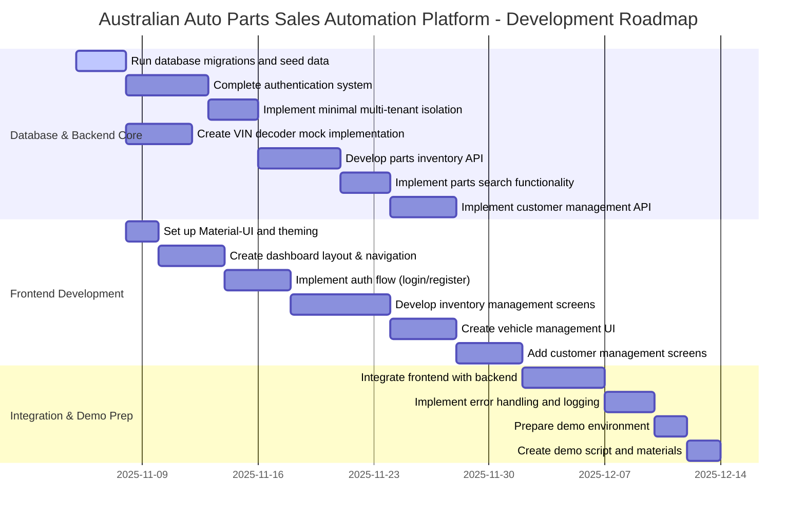

# Australian Auto Parts Sales Automation Platform
## Development Roadmap (4-6 Weeks)

## Dependencies and Risk Factors

### Critical Dependencies
1. **Database First**: All features depend on properly configured database
2. **Authentication System**: Required before implementing tenant isolation
3. **VIN Decoder Mock**: Allows development to proceed without external API
4. **Backend-Frontend Integration**: Careful coordination needed

### Risk Factors
1. **NEVDIS API Integration**: Highest risk due to unfamiliarity - mitigated by using mock implementation
2. **Multi-Tenant Architecture**: Getting this right early is important - focusing on minimal implementation
3. **Performance Requirements**: <200ms API response time might be challenging - monitor closely

## Implementation Priorities

### Week 1-2 Focus
- Database setup and core authentication
- Basic multi-tenant isolation
- Mock VIN decoder service
- Frontend foundation with Material-UI

### Week 3-4 Focus
- Parts inventory API and search
- Dashboard and inventory screens
- Authentication flow in frontend
- Customer management API

### Week 5-6 Focus
- Frontend-backend integration
- Vehicle management with VIN lookup
- Error handling improvements
- Demo environment preparation

## MVP Components
- ✅ Multi-tenant architecture (minimal implementation)
- ✅ Authentication system
- ✅ Parts inventory management (core CRUD)
- ✅ Vehicle lookup via VIN (mock implementation)
- ✅ Basic customer management
- ✅ Simple, functional UI

## Post-MVP Priorities
- Real NEVDIS API integration
- Advanced search capabilities
- Quote and order management
- Reporting dashboard
- Mobile responsive design
- Payment processing integration