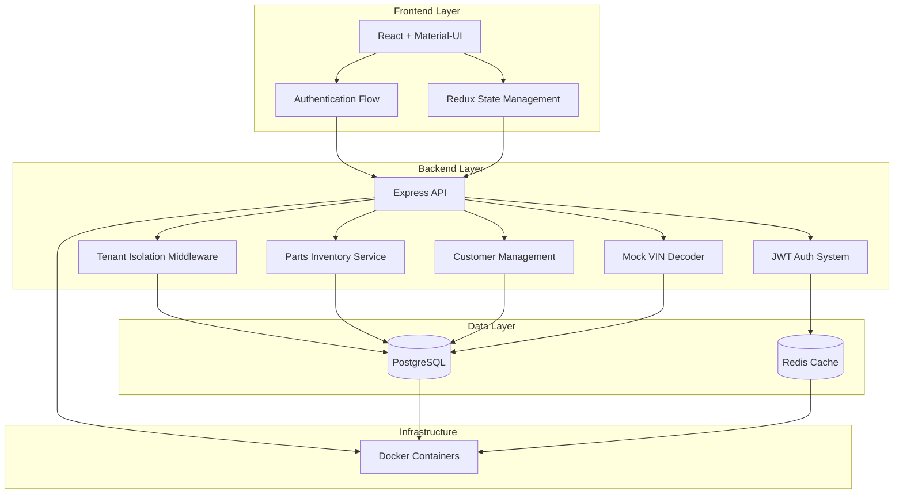
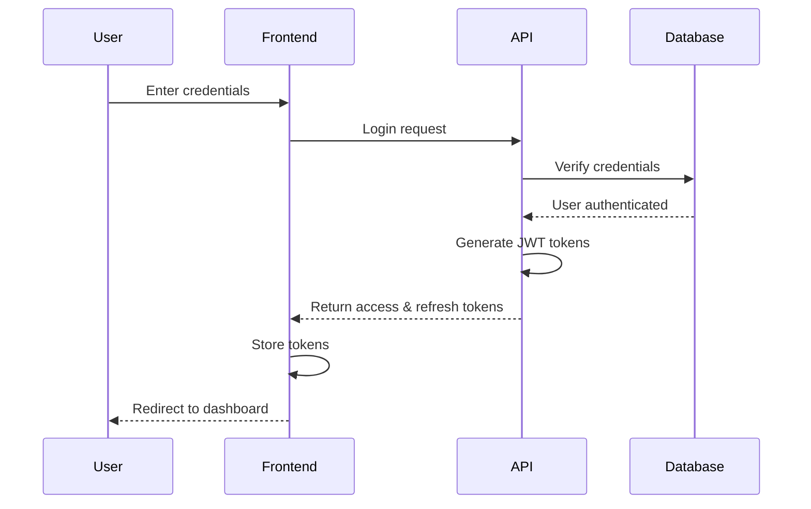
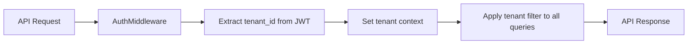
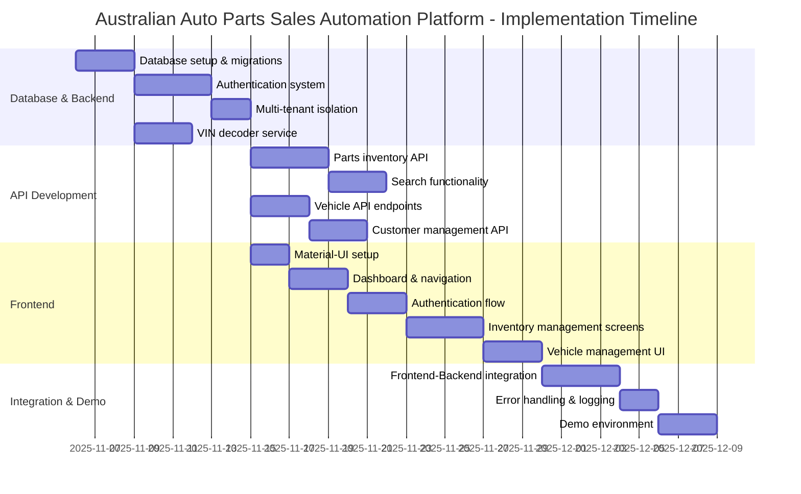

# Australian Auto Parts Sales Automation Platform - Implementation Plan

## Architecture Overview

## Authentication Flow

## Multi-Tenant Data Isolation

## Implementation Timeline

## Technical Considerations

### Database & Authentication (Week 1-2)
- PostgreSQL with Prisma ORM
- Multi-tenant data isolation using middleware
- JWT authentication with refresh token rotation
- Email verification and password reset flows

### API Development (Week 2-3) 
- RESTful API design with proper versioning
- Advanced filtering and pagination for search
- Mock VIN decoder with Australian vehicle data
- Documentation with Swagger/OpenAPI

### Frontend Foundation (Week 3-4)
- Material-UI with customized Australian theme
- Redux for state management
- Responsive layout optimized for desktop and tablets
- Reusable component library

### Feature Completion (Week 5-6)
- Inventory and vehicle management screens
- Customer management functionality
- Comprehensive error handling
- Demo environment with sample data

## Testing Strategy

- Unit tests for critical business logic
- Integration tests for API endpoints
- UI component tests for frontend
- End-to-end tests for critical user flows

## Deployment Considerations

- Docker containerization for consistent environments
- Environment-specific configuration
- Database migration and seed scripts
- Documentation for deployment process